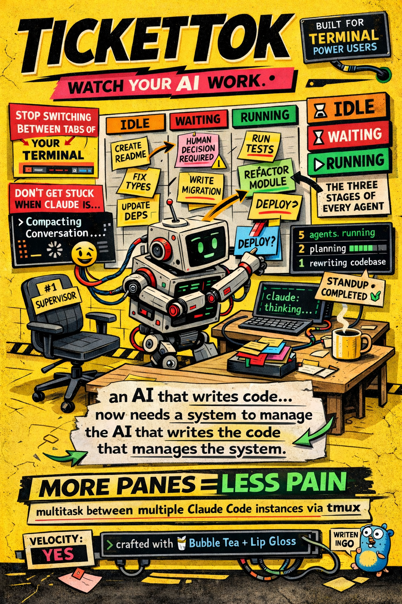
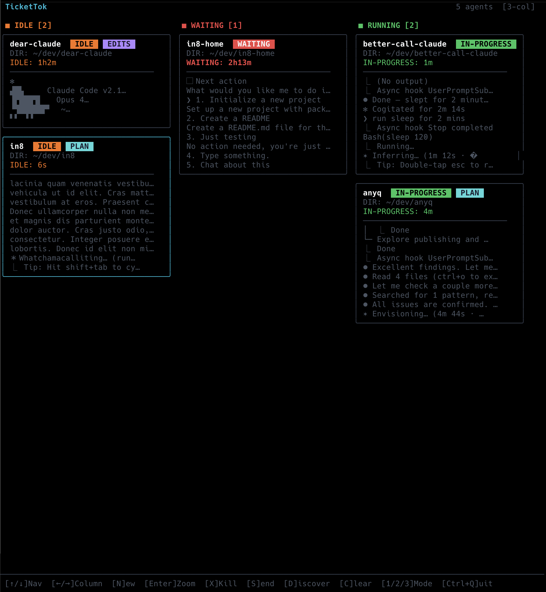

# TicketTok



Auto-updating status tracking dashboard for multitasking between multiple Claude Code instances via tmux.



## Install

**Homebrew** (macOS/Linux):
```bash
brew install sns45/tap/tickettok
```

**Shell script** (macOS/Linux):
```bash
curl -sSfL https://raw.githubusercontent.com/sns45/tickettok-releases/main/install.sh | sh
```

**Binary download**: grab a release from [GitHub Releases](https://github.com/sns45/tickettok-releases/releases).

## Prerequisites

- **tmux** — `brew install tmux` (macOS) or `sudo apt install tmux` (Linux/WSL2)
- **Claude CLI** — `npm install -g @anthropic-ai/claude-code`

### Windows (WSL2)

TicketTok requires tmux and Unix PTYs, so it runs inside WSL2 on Windows:

1. Install WSL2: `wsl --install` (from PowerShell as admin, then reboot)
2. Inside WSL2:
   ```bash
   sudo apt update && sudo apt install -y tmux
   ```
3. Install the [Claude CLI](https://docs.anthropic.com/en/docs/claude-code) inside WSL2
4. Install using Homebrew or the shell script above

## Usage

```
tickettok              Launch the TUI dashboard
tickettok start        Launch the TUI dashboard
tickettok add <dir>    Spawn an agent headlessly (--name <name> optional)
tickettok list         List all agents
tickettok kill <name>  Kill an agent by name or ID
tickettok discover     Scan for running claude instances
tickettok clear        Remove completed agents
tickettok help         Show help
```

## TUI Keybindings

| Key | Action |
|-----|--------|
| `↑`/`↓` or `j`/`k` | Navigate agents |
| `←`/`→` or `h`/`l` | Move between columns (board mode) |
| `1` / `2` / `3` | Switch to carousel / 2-col / 3-col layout |
| `N` | Spawn new agent |
| `Enter` | Zoom into agent (full terminal view) |
| `Ctrl+Q` | Return from zoom |
| `S` | Send message to selected agent |
| `X` | Kill selected agent |
| `D` | Discover running claude instances |
| `C` | Clear completed agents |
| `Ctrl+Q` | Quit (agents keep running in tmux) |

In **zoom mode**, all keystrokes are forwarded to the agent's tmux session.

## Views

- **Board** (2 or 3 columns) — agents sorted into IDLE, WAITING, RUNNING columns
- **Carousel** (1 column) — vertical scrollable list of all agents
- **Zoom** — full-screen view of a single agent's tmux pane, with live capture

## How It Works

Each agent runs `claude` inside a detached **tmux session**. TicketTok attaches a background PTY client so `capture-pane` always has content to grab.

**Status detection** uses two methods:
1. **Claude Code hooks** (fast) — a shell script writes JSON status files on lifecycle events
2. **capture-pane scraping** (fallback) — parses terminal output looking for spinners, permission prompts, idle indicators

**State** is persisted to `~/.tickettok/state.json` so agents survive TUI restarts.

## License

Copyright (c) 2025-2026 sns45. All rights reserved. See [LICENSE](LICENSE) for details.
